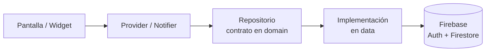

# Arquitectura

## Enfoque

Arquitectura **por funcionalidades (feature-first) con tres capas**. Cada funcionalidad (auth, canchas, reservas, perfil, admin) vive en su propia carpeta, lo que permite que cinco personas trabajen en paralelo con pocos conflictos de Git.

| Capa | Contiene | Regla |
|---|---|---|
| `presentation` | Pantallas, widgets y providers (Notifiers) | No importa nada de Firebase. Solo habla con providers. |
| `domain` | Entidades y contratos (clases abstractas de repositorios) | Dart puro: sin Flutter ni Firebase. |
| `data` | Modelos con `fromMap`/`toMap`, datasources y la implementación de los repositorios | Único lugar donde se usa Firebase. |



Gracias a esta separación, en las pruebas se reemplaza el repositorio real por uno simulado (`mocktail`) sin tocar la UI.

## Estructura de carpetas

```
lib/
├── main.dart                  # Inicializa Firebase y ProviderScope
├── app.dart                   # MaterialApp.router, tema
├── core/
│   ├── constants/             # Textos fijos, colecciones de Firestore, horarios
│   ├── errors/                # Excepciones y mensajes de error comunes
│   ├── router/                # go_router: rutas y redirecciones por sesión/rol
│   ├── theme/                 # Colores, tipografía, ThemeData
│   ├── utils/                 # Formato de fecha, moneda, validadores
│   └── widgets/               # Botones, campos, tarjetas, loaders reutilizables
└── features/
    ├── auth/
    │   ├── data/              # auth_repository_impl.dart, usuario_model.dart
    │   ├── domain/            # usuario.dart, auth_repository.dart
    │   └── presentation/      # login_screen.dart, registro_screen.dart, auth_providers.dart
    ├── canchas/
    ├── reservas/
    ├── perfil/
    └── admin/
test/                           # Replica la estructura de lib/
```

### Convenciones de nombres
- Archivos y carpetas: `snake_case` (`detalle_cancha_screen.dart`).
- Clases: `PascalCase` (`DetalleCanchaScreen`).
- Pantallas terminan en `_screen.dart`; providers en `_providers.dart`; modelos en `_model.dart`.
- El código se escribe en español para el dominio (`Cancha`, `Reserva`) y en inglés para términos técnicos de Flutter (`Screen`, `Repository`).

## Tipos de usuario en la app

| Rol | Puede |
|---|---|
| `cliente` | Ver canchas, ver disponibilidad, reservar, ver y cancelar sus reservas, editar su perfil |
| `admin` | Todo lo anterior + crear/editar/desactivar canchas y ver o cancelar cualquier reserva |

El rol se guarda en el documento del usuario en Firestore. Todo usuario se registra como `cliente`; el administrador se asigna manualmente desde Firebase Console.

## Pantallas del MVP

| Ruta | Pantalla | Rol |
|---|---|---|
| `/login` | Inicio de sesión | Público |
| `/registro` | Registro | Público |
| `/` | Listado de canchas (filtro por deporte) | Cliente |
| `/cancha/:id` | Detalle de cancha y selección de fecha/horario | Cliente |
| `/reserva/confirmar` | Resumen y confirmación | Cliente |
| `/mis-reservas` | Reservas próximas e historial, con opción de cancelar | Cliente |
| `/perfil` | Datos del usuario y cerrar sesión | Cliente |
| `/admin/canchas` | Gestión de canchas | Admin |
| `/admin/reservas` | Reservas por cancha y fecha | Admin |

## Modelo de datos (Cloud Firestore)

### `usuarios/{uid}`
| Campo | Tipo | Ejemplo |
|---|---|---|
| nombre | string | "Ana López" |
| email | string | "ana@correo.com" |
| telefono | string | "55551234" |
| rol | string | "cliente" \| "admin" |
| creadoEn | timestamp | |

### `canchas/{canchaId}`
| Campo | Tipo | Ejemplo |
|---|---|---|
| nombre | string | "Cancha Sintética 1" |
| deporte | string | "futbol" \| "basquetbol" \| "voleibol" \| "padel" |
| descripcion | string | |
| ubicacion | string | |
| precioPorHora | number | 150 |
| imagenUrl | string | |
| horaApertura | number | 7 |
| horaCierre | number | 22 |
| activa | bool | true |

### `reservas/{reservaId}`
| Campo | Tipo | Ejemplo |
|---|---|---|
| canchaId | string | |
| canchaNombre | string | "Cancha Sintética 1" (copiado para mostrar sin otra consulta) |
| usuarioId | string | |
| fecha | string | "2026-10-15" (formato `yyyy-MM-dd`) |
| hora | number | 18 (bloques de 1 hora) |
| estado | string | "confirmada" \| "cancelada" |
| total | number | 150 |
| creadoEn | timestamp | |

## Regla clave: evitar reservas duplicadas

El `reservaId` **no es aleatorio**: se construye como `{canchaId}_{yyyyMMdd}_{HH}`, por ejemplo `abc123_20261015_18`. Así solo puede existir un documento por cancha, fecha y hora.

La reserva se crea dentro de una **transacción** de Firestore:
1. Leer el documento con ese ID.
2. Si existe y su estado es `confirmada` → error "Horario no disponible".
3. Si no existe, o existe pero está `cancelada` → escribir la reserva como `confirmada`.

Si dos usuarios reservan el mismo horario al mismo tiempo, Firestore reintenta la transacción y solo uno lo logra. Para reservar varias horas seguidas se crea un documento por hora dentro de la misma transacción.

**Disponibilidad:** la pantalla de detalle consulta `reservas` donde `canchaId == X`, `fecha == Y` y `estado == 'confirmada'`, y marca como ocupadas esas horas entre `horaApertura` y `horaCierre`. Firestore pedirá crear un índice compuesto la primera vez; el enlace aparece en la consola de depuración.

## Reglas de seguridad

Las reglas iniciales están en [`firestore.rules`](../firestore.rules). Se publican desde Firebase Console o con `firebase deploy --only firestore:rules`. Cualquier cambio a las reglas se hace mediante PR.

## Manejo de errores y estados de carga

- Los repositorios lanzan excepciones propias (`core/errors`) con mensajes en español, nunca errores crudos de Firebase.
- Los providers exponen `AsyncValue`; las pantallas siempre manejan los tres estados: cargando, error y datos.
